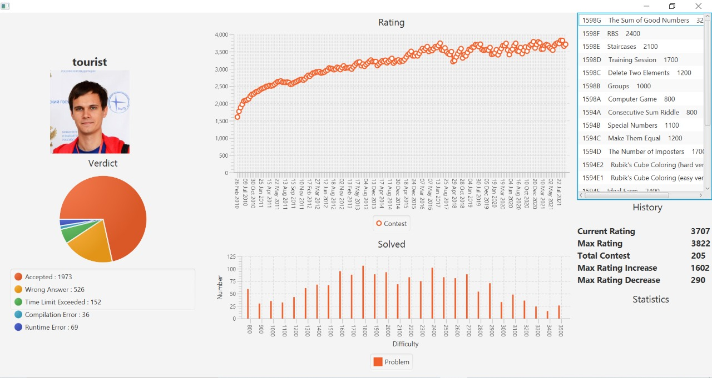
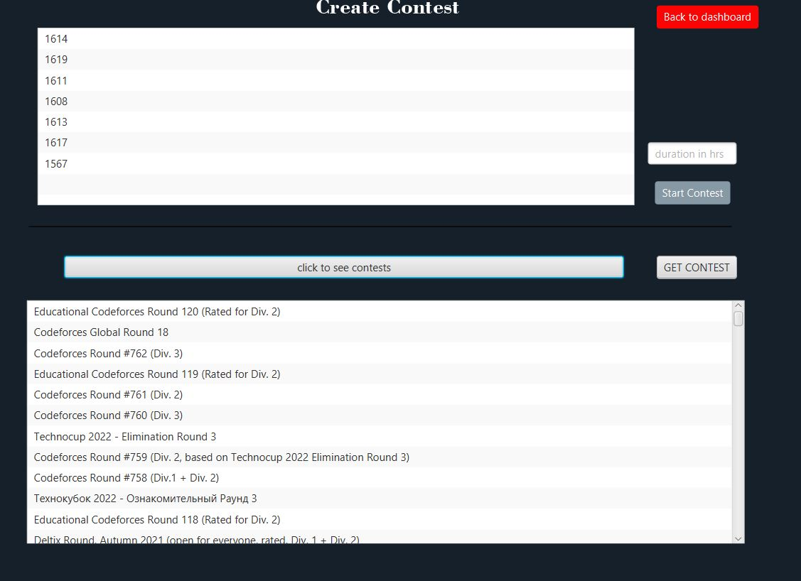
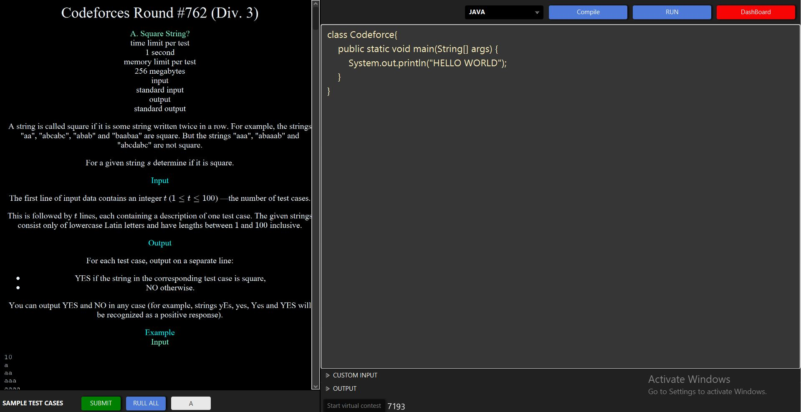
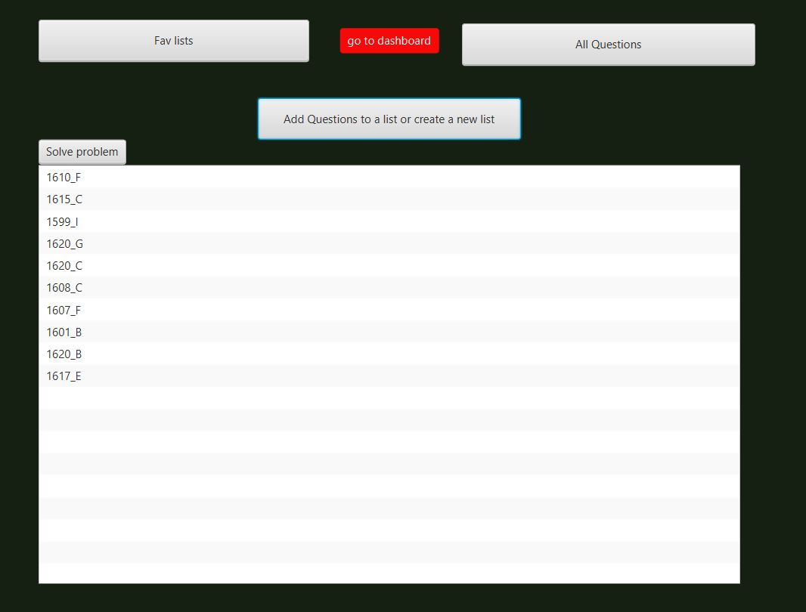
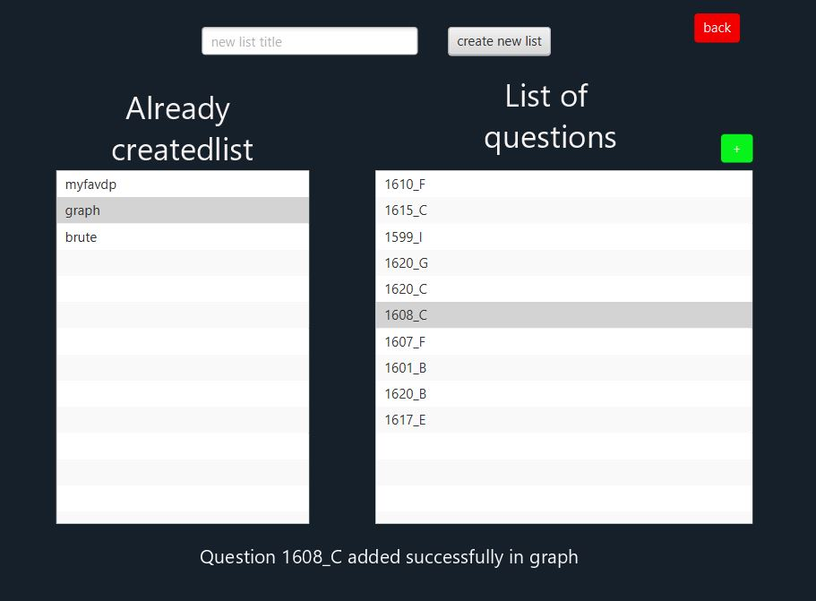
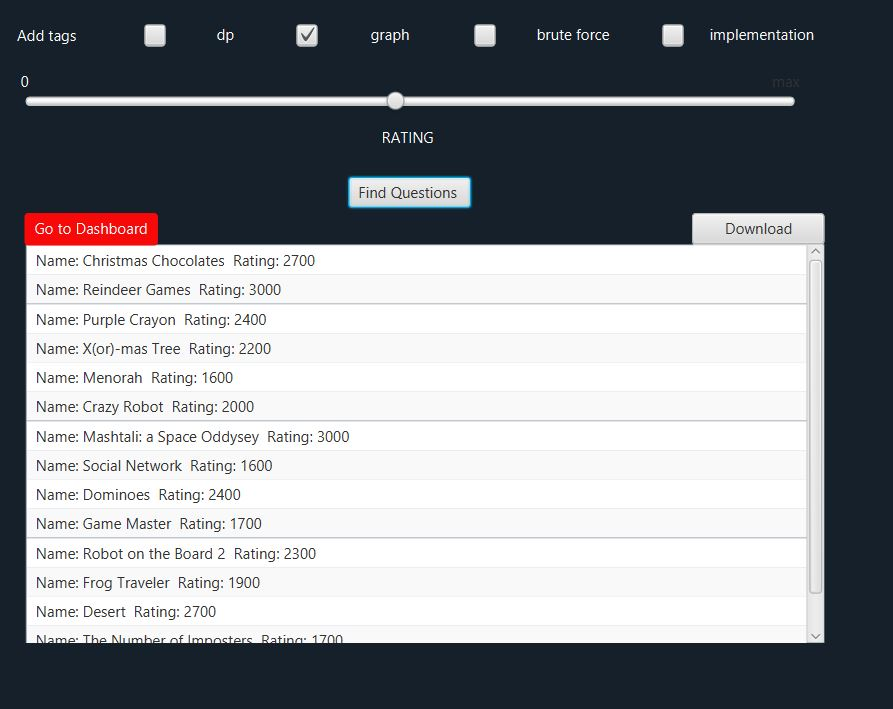
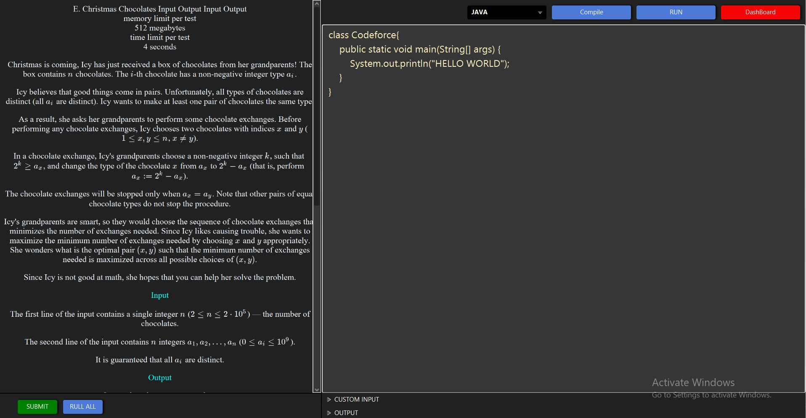

  

# Offcoder

an alternative to an online coding platform, which will help those who don't have a good internet connection. A platform in which one can download
questions, set up contests, submit answers and later on when connected to the internet can see the final result.

## Features

<h4><b>Basic:-<b></h4>

<ol>
<li>Users should be able to pick questions randomly as well as specifically
from any one platform (codeforces, leetcode, etc) and be able to
download it with its sample test case. (external libraries may be used
for scraping as well as APIs.)
 </li>
<li>Users can schedule a contest with a chosen problem or randomly selected contest.
 </li>
 <li>Users should be able to submit the code in various languages.</li>
<li>The platform should be able to compile the code and display the output against any input.</li>
<li>When the user is connected to the internet the platform on its own should be able to submit the user code and give the user a final verdict on its submission.</li>
<li>Users should be able to make personalized lists for various questions that they have solved with solutions</li>
<li> The platform should have a history of submitted questions.</li>

</ol>
<h4><b>Advanced:-</h4>
<ol>
<li>The external libraries used in the previous section should be replaced
with your own scraper algorithm.</li>

<li>The platform should have an elegant dashboard for statistics of user’s
performance through graphs, pie charts, etc.</li>

<li>The platform should have an  download feature for favorite
topics selected . The download should happen in when connected to the Internet by user choice.</li>

<li>The platform can suggest questions similar to the current question.</li>
</ol>
  
  
<h4 style="color:green">Bonus Features:&#127882;</h4>

<ol>
  <li>Ability to view and cancel Queued tasks.</li>
<li>Default code.</li>
  </ol>
  
<h4 style="color:red">How to access</h4>

<ol>
  <li>git clone</li>
<li>upgrade maven dependencies</li>
  <li>run helloapplication</li>
  </ol>

### tech stack
<ul>

 <li>Front End:- JavaFX</li>
<li>Backend :- JAVA</li>
<li>Libraries going to use:-  Jsoup, Jackson,Selenium</li>
<li>Tools used:-  IntelliJ, GitHub, SceneBuilder, maven</li>
  <li>Api used: CodeforcesAPI.</li>
</ul>

## Project descriptors:
*flow

Link: 
https://embed.creately.com/CyiN5sireEK?type=svg

*uml
 https://lucid.app/lucidchart/fd81f5d8-2f0a-4705-a2d0-7428261cb87e/edit?invitationId=inv_74ea1e41-64b1-4d03-b109-9e5ff443e9a2

*brainstroming 
https://lucid.app/lucidchart/9417a0ae-aa7c-4ce8-8b2c-55fb5dba155e/edit?invitationId=inv_22fb441b-1d2e-4aaf-9c27-07be9f3b0a42

## screenshots

  

    
    
    
    
    
    
    
  

## Authors

[@mokshKori](https://github.com/mokshkori) 
[@neerajJoshi](https://github.com/neeraj_2307) 
[@AnubhavGoel](https://github.com/AnubhavGoel2808)
